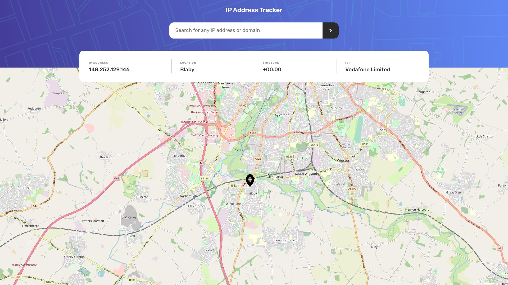

### The challenge

Users should be able to:

- View the optimal layout for each page depending on their device's screen size
- See their own IP address on the map on the initial page load
- Search for any IP addresses or domains and see the key information and location

### Screenshot




### Links

- Live Site URL: [https://vmpetkov90.github.io/ip-tracker/]


### Built with

- Semantic HTML5 markup
- CSS3
- JavaScript
- jQuery
- AJAX
- JSON


### What I learned

Developing this project has helped me learn how to make request using AJAX and pull data from API in JSON and dislaying it.

```js
    function getIp(domainIP = "", searchParam = "") {

        $(".loading").show();

        const ip = "https://geo.ipify.org/api/v1?apiKey=at_TBKWxnKTxV2ZdHvGovxxkctmjm5zv" + domainIP + searchParam;

        $.getJSON(ip)
            .done(function (result) {
                showMap(result.location.lat, result.location.lng);
                $("#ip").text(result.ip);
                $("#location").text(result.location.city);
                $("#timezone").text(result.location.timezone);
                $("#isp").text(result.isp);
                $(".loading").hide();
            })
            .fail(function () {
                $(".loading").hide();
                errorMsg.show();
            })
    }
```


## Author

- Website - [Vasil Petkov](https://www.vasilpetkov.com)
